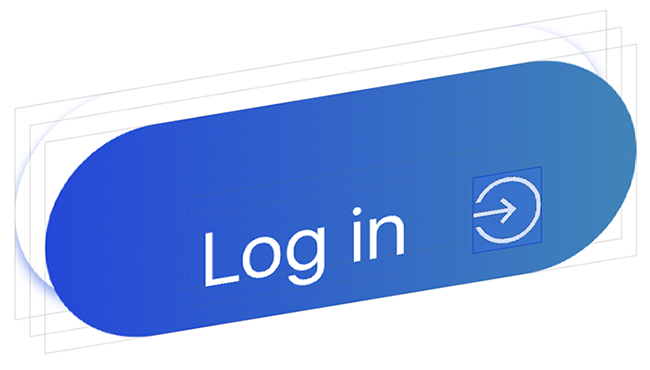
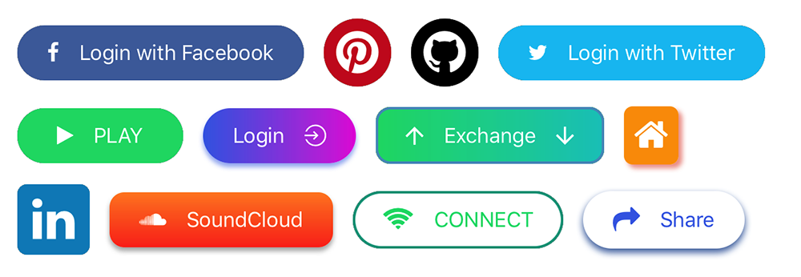
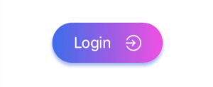
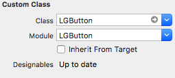
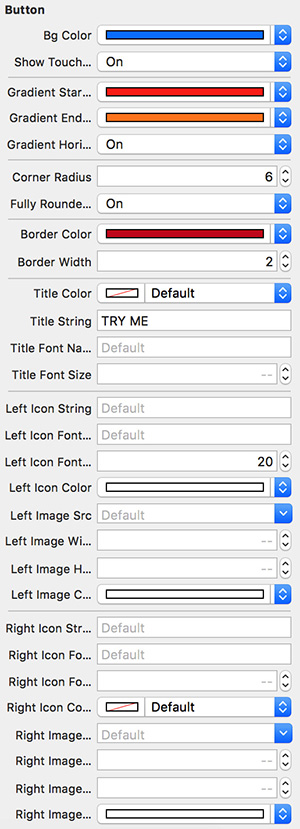
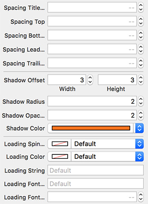

[](https://travis-ci.org/loregr/LGButton)  [](./LICENSE.md) [](http://cocoadocs.org/docsets/LGButton)

A fully customisable subclass of the native `UIControl` which allows you to create beautiful buttons without writing any line of code.


## Preview

You'll be able to create buttons like these by using only the interface builder:



Moreover you can use them for asynchronous operations.




## Install

To integrate _LGButton_ into your Xcode project using CocoaPods, specify it in your `Podfile`:

```ruby
use_frameworks!

pod 'LGButton'
```

## Icons and images

You can add images/icons to your button, icons are taken from different ready to use font icons collections, images can be imported directly from your project assets folder.

You can customise icons/images on the left and/or on the right of the button title.

### Icons

Icons are managed by [SwiftIconFont](https://github.com/0x73/SwiftIconFont) integration, so you can easily add and customise button icons by choosing from the most popular font icons collections. In particular:


| Collection         | Font name | Cheat Sheet                               |
|--------------|--------|-------------------------------------------|
| Font Awesome | fa    | [List](https://fontawesome.com/v4.7.0/icons/) |
| Ion Icons    | io    | [List](http://ionicons.com)               |
| Octicons     | oc    | [List](https://octicons.github.com)       |
| Open Iconic  | ic    | [List](https://useiconic.com/open/)       |
| Material Icon   | ma    | [List](https://design.google.com/icons/)       |
| Themify   | ti    | [List](https://themify.me/themify-icons)       |
| Map Icons   | mi    | [List](http://map-icons.com)       |

The main properties that you need to set in order to use font icons are:
- **Icon Font Name**: you can pick one value from the table above, different values will be ignored <i>(please consider that not all the icons may be available since this library may not be updated right after a font library update).</i>

- **Icon String**: the icon name taken from the cheatsheet without the collection prefix.

_So, if you want to use `fa-align-left` from `Font Awesome`, **Icon Font Name** will be `fa` and **Icon String** will be `align-left`._

### Images
Set the **Image source** property in order to use an image from your assets folder.

_Note: if **Image source** is set, every other property about the font icon on the same side will be ignored._

## Usage

Drag and drop an `UIView` object into your view controller and set its class and module to `LGButton`.



Customise your button by setting the properties from the Interface Builder.

 

### Supported Attributes

| Attribute        | Description      | Default value  |
| ------------- |-------------| -----|
| Bg Color      | Main background color     | clear |
| Show Touch Feedback      | Whether a touch feedback should be visible or not     | true |
| Gradient Start Color      | The first color of the gradient background     | nil |
| Gradient End Color      | The second color of the gradient background     | nil |
| Gradient End Color      | The second color of the gradient background     | nil |
| Gradient Horizontal      | Whether the gradient should be horizontal or not     | false |
| Gradient Rotation      | Set the gradient rotation angle (degrees from -360 to 360)     | 0 |
| Corner Radius      | The corner radius     | 0.0 |
| Fully Rounded Corners      | Apply a corner radius equals to height/2  | false |
| Border Color      | The border color     | white |
| Border Width      | The border width     | 0.0 |
| Title Color      | The title color     | white |
| Title String      | The title string      | _EMPTY&#95;STRING_ |
| Title Font Name      | The title font name    | nil |
| Title Font Size      | The title font size    | 14.0 |
| Vertical orientation      | If `true` the left icon will be placed on the top and the right icon will be placed on the bottom    | false |
| Left Icon String      | The name of the left icon (taken from the cheat sheet)    | _EMPTY&#95;STRING_ |
| Left Icon Font Name      | The name of the left icon font name (taken from the table above)    | _EMPTY&#95;STRING_ |
| Left Icon Font Size      | The left icon font size    | 14.0 |
| Left Icon Color      | The left icon color    | white |
| Left Image Src      | The name of the left source asset    | nil |
| Left Image Height      | The left image height    | 20.0 |
| Left Image Width      | The left image width    | 20.0 |
| Left Image Color      | The left image tint color    | nil |
| Right Icon String      | The name of the right icon (taken from the cheat sheet)    | _EMPTY&#95;STRING_ |
| Right Icon Font Name      | The name of the right icon font name (taken from the table above)    | _EMPTY&#95;STRING_ |
| Right Icon Font Size      | The right icon font size    | 14.0 |
| Right Icon Color      | The right icon color    | white |
| Right Image Src      | The name of the right source asset    | nil |
| Right Image Height      | The right image height    | 20.0 |
| Right Image Width      | The right image width    | 20.0 |
| Right Image Color      | The right image tint color    | nil |
| Spacing Title Icon      | The spacing between the title and the image/icon    | 16.0 |
| Spacing Top      | The internal top spacing    | 8.0 |
| Spacing Bottom      | The internal bottom spacing    | 8.0 |
| Spacing Leading      | The internal leading spacing    | 16.0 |
| Spacing Trailing      | The internal trailing spacing    | 16.0 |
| Shadow Offset      | The shadow offset   | (0,0)|
| Shadow Radius      | The shadow radius   | 0.0|
| Shadow Opacity      | The shadow opacity   | 1.0|
| Shadow Color      | The shadow color   | black|
| Loading spinner Color      | The loading spinner color   | white|
| Loading String      | The loading message text   | _EMPTY&#95;STRING_ |
| Loading Font Name      | The loading message font name   | _EMPTY&#95;STRING_ |
| Loading Font Size      | The loading message font size    | 14.0 |
| Left Aligned      | `true` if the button items should be aligned to the left. It requires the button to have a fixed width    | false |
| Right Aligned      | `true` if the button items should be aligned to the right. It requires the button to have a fixed width    | false |

You can download the demo project if you want to check more.

## Issues


Feel free to submit issues and features requests.

## Contributing

Contributions are more then welcome. Your contribution may include bug fixing or/and new features.

Please follow the "fork-and-pull" Git workflow (check [here](./CONTRIBUTING.md) for more).

1. **Fork** the repo on GitHub
2. **Clone** the project to your own machine
3. **Commit** changes to your own branch
4. **Push** your work back up to your fork
5. Submit a **Pull request** so that I can review your changes


_NOTE: Be sure to merge the latest from "upstream" before making a pull request!_

## Author

Lorenzo Greco

- [Website](https://lorenzogreco.com)
- [LinkedIn](https://www.linkedin.com/in/lorenzo-greco-61118195/)

## Credits
[SwiftIconFont](https://github.com/0x73/SwiftIconFont) project is used in order to provide ready to use icons.

## License
```
MIT License

Copyright (c) 2017 Lorenzo Greco

Permission is hereby granted, free of charge, to any person obtaining a copy
of this software and associated documentation files (the "Software"), to deal
in the Software without restriction, including without limitation the rights
to use, copy, modify, merge, publish, distribute, sublicense, and/or sell
copies of the Software, and to permit persons to whom the Software is
furnished to do so, subject to the following conditions:

The above copyright notice and this permission notice shall be included in all
copies or substantial portions of the Software.

THE SOFTWARE IS PROVIDED "AS IS", WITHOUT WARRANTY OF ANY KIND, EXPRESS OR
IMPLIED, INCLUDING BUT NOT LIMITED TO THE WARRANTIES OF MERCHANTABILITY,
FITNESS FOR A PARTICULAR PURPOSE AND NONINFRINGEMENT. IN NO EVENT SHALL THE
AUTHORS OR COPYRIGHT HOLDERS BE LIABLE FOR ANY CLAIM, DAMAGES OR OTHER
LIABILITY, WHETHER IN AN ACTION OF CONTRACT, TORT OR OTHERWISE, ARISING FROM,
OUT OF OR IN CONNECTION WITH THE SOFTWARE OR THE USE OR OTHER DEALINGS IN THE
SOFTWARE.
```
